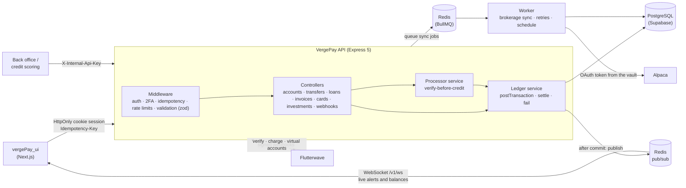
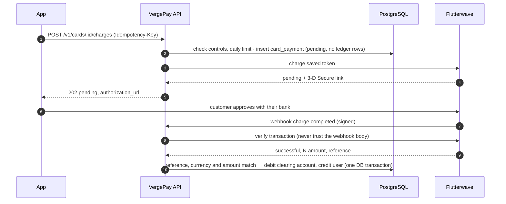
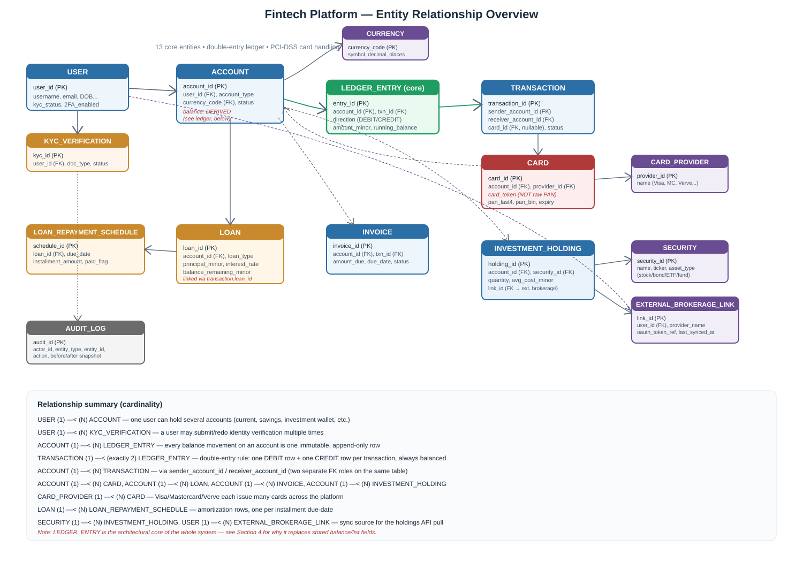
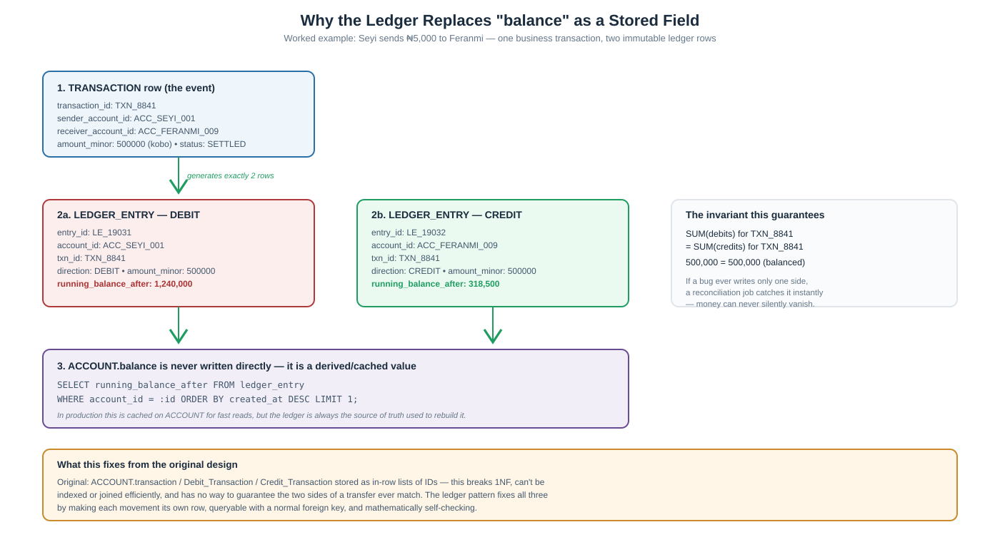

# VergePay API

**The backend of VergePay, a fintech platform for Nigerian freelancers and small businesses: accounts, transfers, loans, invoices, card and bank-transfer funding, all on a double-entry ledger that never loses a kobo.**


Built by **[Seyitan Omodara](https://github.com/dunascode-prog)** · Frontend: [vergePay_ui](https://github.com/dunascode-prog/vergePay_ui)

---

## At a glance

| | |
|---|---|
| **What it is** | A REST API for money: open accounts, move money, lend, invoice clients (who pay through a link), and fund accounts by card or bank transfer |
| **Endpoints** | 72, across auth, accounts, transactions, loans, invoices, clients, public pay links, cards, investments, notifications, webhooks and back office, plus a live WebSocket |
| **Live updates** | Debit/credit alerts written in the same DB transaction as the money, pushed over a WebSocket after commit, fanned out across processes with Redis pub/sub |
| **Money model** | Double-entry ledger in integer minor units (kobo). Balances are cached, but the ledger is the truth |
| **Payments** | Flutterwave v3 hosted checkout, card tokenization, 3-D Secure and permanent virtual accounts, verified on the real sandbox |
| **Investments** | Alpaca brokerage connected with OAuth 2.0; holdings synced by a BullMQ worker on Redis, with retries, backoff and a schedule |
| **Security** | TOTP 2FA built from the RFC, HttpOnly cookie sessions with one-time refresh tokens, encrypted secrets, PCI-safe card handling |
| **Testing** | 616-request Postman suite with **1,019 assertions**, including concurrency races, forged-webhook and OAuth attacks, and background-job retries, plus an end-to-end WebSocket check, all passing |

---

## Why this project

Freelancers and small businesses in Nigeria keep personal and business money across several banks and apps, with no single picture of what they're owed, what they owe and what they can spend. VergePay brings that into one place.

This repository is the part where correctness matters most: **the money engine**. Every feature, from a ₦500 transfer to a 30-year loan schedule, eventually writes to one ledger. So the interesting engineering isn't the endpoints; it's making sure that money is never created, lost or moved twice, even when requests race, retry, crash or lie.

---

## Engineering highlights

### A double-entry ledger that can't drift
Every movement of money is a `TRANSACTION` with exactly one `DEBIT` and one `CREDIT` ledger entry, written in one database transaction by a single routine ([`services/ledger.js`](services/ledger.js)). Loans, invoices, refunds and card payments don't move money themselves; they call the same routine.
- **Append-only:** a database trigger rejects any `UPDATE` or `DELETE` on ledger entries. A reversal is a new transaction in the opposite direction, never an edit.
- **Invariants you can check:** debits equal credits for every transaction, every cached balance equals its ledger sum, and loan and invoice balances match their transactions. The test suite asserts all of these across the whole database at four checkpoints.

### Concurrency: two requests, one balance
Accounts are locked with `SELECT … FOR UPDATE` **in a deterministic order** (by `account_id`), so opposite transfers (A→B and B→A) can't deadlock. Loans and invoices lock their own row first, then the accounts.
- Verified by firing the requests at the same moment: **5 simultaneous payments of one invoice → exactly 1 succeeds**, 4 get `409`. The same holds for refunds and loan repayments.
- A `CHECK (balance_minor >= 0)` constraint is the last line of defence against a double spend.

### Idempotency in three layers
Every endpoint that moves money requires an `Idempotency-Key` ([`utils/idempotency.js`](utils/idempotency.js)):
1. **Stored responses:** a retry with the same key and body replays the original response. A different body gets `422`, and a request still in flight gets `409`.
2. **Crash safety:** if the server dies after committing but before saving the response, the retry reaches the ledger, which finds the committed transaction by its unique key and replays it (`postOnce`). This is tested by deleting the stored record and retrying.
3. **Database guarantees:** unique constraints mean a loan is disbursed once, an invoice is settled once, and a payment is refunded once.

### Payments you can trust, from a processor you verify
The Flutterwave integration ([`services/flutterwave.js`](services/flutterwave.js), [`services/processorPayments.js`](services/processorPayments.js)) assumes every input could be forged:
- **PCI boundary:** the card number is typed on Flutterwave's hosted page. The API only ever sees a token, BIN and last four, and **never accepts a token from the client**, because that would let anyone attach a card they don't own.
- **Verify before crediting:** a webhook or redirect is only a hint. Money is credited only after Flutterwave's verify API confirms the payment *and* its reference, currency and amount all match. A test sends a correctly signed webhook claiming ₦999,999 for a ₦100 payment; the account is credited ₦100.
- **Signed webhooks:** v3 `verif-hash` and v4 HMAC-SHA256 are both checked in constant time, and events are deduplicated.
- **Settles later, like real cards:** a card charge stays `pending` with **no ledger rows** until the processor confirms, then settles or fails. A charge confirmed after its account closed is flagged for manual refund instead of sitting pending forever.
- **Tested against the real sandbox,** which surfaced two behaviours Flutterwave's docs don't mention: saved-card charges can require 3-D Secure every time, and saved-card charges reject localhost redirect URLs. Both are handled.

### 2FA from first principles
TOTP two-factor authentication ([`utils/totp.js`](utils/totp.js)) is implemented directly from RFC 6238 and verified against the RFC's test vectors, not pulled from a package.
- Secrets are **AES-256-GCM encrypted at rest**, and each code works **once** (the used time step is recorded under a row lock).
- Signing in with 2FA on gives a **limited session** that can only verify a code, and it stays limited across refreshes.
- Sensitive actions (adding or removing a card, unblocking, changing spending limits, turning 2FA off) require a code confirmed in the **last 5 minutes**.
- Brute force is cut off after 5 wrong codes per 15 minutes.

### Background jobs and a brokerage behind OAuth
Investment holdings are synced from a user's **Alpaca** brokerage account by a **BullMQ worker on Redis** ([`worker.js`](worker.js), [`services/brokerageSync.js`](services/brokerageSync.js)), never inside an HTTP request, so a slow or rate-limited brokerage can't hold up the API.
- **Connecting is real OAuth 2.0:** the user logs in on the brokerage's own site, and our server only ever sees a one-time code.
  - The `state` that protects the callback is single use, expires in 10 minutes, and is stored only as a hash.
  - The access token lives **encrypted in a vault table**; the link row holds only a reference ([`services/vault.js`](services/vault.js)).
- **Retries that know what's worth retrying:** rate limits and outages are retried with exponential backoff, up to 5 attempts. A refused token isn't retried at all; the link is marked `expired` for the user to reconnect.
- **Idempotent and ordered:** one job id per link means asking again while a sync is queued returns the same job. A database advisory lock stops a manual sync and a scheduled one from overlapping. Every sync upserts the latest state, and positions the user has sold are removed.
- **A scheduler** re-syncs every link that's due, every 15 minutes, with exactly one schedule no matter how many workers run.

### Live updates that never lie
When money moves, the customer's dashboard updates by itself and an alert lands in the bell, like a bank's debit and credit alerts ([`services/notifications.js`](services/notifications.js), [`services/realtime.js`](services/realtime.js), [`realtime/websocketServer.js`](realtime/websocketServer.js)).
- **Written with the money:** the ledger writes the alerts inside the same DB transaction that moves the money, so an alert exists exactly when the money moved. A unique index means a replayed settlement can never alert twice.
- **Sent only after commit:** `withTransaction` gained an `afterCommit` hook. Events are published only once the data is committed, so a browser is never told about money that then rolls back.
- **Any process, any socket:** events travel over Redis pub/sub, so an event raised in the worker or on another API instance reaches the socket wherever it's held. Without Redis they stay in-process, which is enough for one API on a laptop.
- **Same session, same rules:** the socket authenticates with the same HttpOnly cookie as HTTP. It refuses another site's Origin (cross-site WebSocket hijacking) and a session still waiting for its 2FA code. It closes with `4401` the moment the short-lived token expires, so the browser refreshes and reconnects.
- **Best effort on top of a durable copy:** `GET /v1/notifications` is the source of truth. A browser that was offline catches up when it reconnects.

### Invoices anyone can pay
A freelancer's clients mostly aren't on VergePay, so an invoice goes to a client from a client book and is paid through a link, like a hosted invoice ([`services/invoices.js`](services/invoices.js), [`controllers/payLinkController.js`](controllers/payLinkController.js)).
- **Drafts, then numbers:** an invoice is an editable draft until it's sent. Sending gives it the issuer's next number (`INV-0001`); numbers are handed out at send time, so deleted drafts leave no gaps.
- **Line items to the kobo:** quantity × price is worked out in integers and rounded half up, and the invariant check proves every invoice's total equals its items.
- **A capability link:** the pay link carries 256 random bits and opens that one invoice and nothing else. The page shows who's billing, what for and how much, never account numbers or emails, and it's rate-limited per link.
- **Paid like a card top-up:** checkout is a pending payment from the processor's clearing account into the issuer's wallet. It settles only after Flutterwave's verify endpoint agrees on reference, currency and amount, and the invoice is marked paid in that same DB transaction. Webhook or redirect, whichever arrives first, does it once.
- **Two payers at once:** if a second payment lands after the invoice is paid, the money is still credited (it really arrived) and the issuer is alerted to return it. Nothing is silently lost.
- **Email that can't block a request:** invoices, reminders and receipts are saved exactly as sent (`email_log`), then delivered by the worker with retries. Any SMTP service works; development uses Ethereal's free fake inboxes, with a preview link per message.

### Loan maths that adds up to the kobo
Amortization ([`services/amortization.js`](services/amortization.js)) rounds the exact schedule's *cumulative* principal rather than the monthly payment. The naive approach (round the payment, carry the error) visibly drifts on long, small loans, and can pay a loan off early or produce negative principal. The final algorithm was property-tested across **21,681 amount/rate/term combinations**: principal always sums exactly, nothing is ever negative, and every installment is within 2 kobo of the level payment.

---

## Architecture



### How a saved-card top-up works



### Data model





The full designs are in [`documentation/`](documentation/): the API design (`Fintech_Platform_API_Design.pdf`) and the data model (`Fintech_Platform_Data_Model.pdf`).

---

## Features

<details>
<summary><b>Auth and profile</b>: sign-up, sign-in, one-time refresh tokens, TOTP 2FA</summary>

| Method | Endpoint | |
|---|---|---|
| POST | `/v1/auth/signup` | Create an account (strong-password rules) |
| POST | `/v1/auth/signin` | Sets HttpOnly session cookies. With 2FA on, returns a limited session |
| POST | `/v1/auth/refresh` | Rotates the refresh token. Each works once; reuse is rejected |
| POST | `/v1/auth/logout` | Revokes the session |
| POST | `/v1/auth/2fa/enable` | New TOTP secret and `otpauth://` URI for a QR code |
| POST | `/v1/auth/2fa/verify` | Finishes setup, answers the sign-in challenge, or re-confirms |
| DELETE | `/v1/auth/2fa` | Turn 2FA off (needs a recent code) |
| GET / PATCH | `/v1/users/me` | Profile. Name and date of birth lock once KYC starts |
| POST | `/v1/kyc/submissions` | Verify identity by BVN, legal name and date of birth. `202`, decided asynchronously (the client polls). The BVN is stored encrypted in the vault, never returned. On approval the legal name moves onto the profile and locks. A sandbox provider decides in development; a real one (Dojah, Smile ID, Prembly) plugs into the same decision function |
| GET | `/v1/kyc/submissions` · `/:id` | Submission history, newest first, with a rejection reason so a customer can fix it |
| GET | `/v1/accounts/lookup?account_number=` | **Name enquiry** before sending: the wallet holder's name. Verified customers only, 30 per 15 minutes, never system or loan accounts |
</details>

<details>
<summary><b>Accounts</b>: current, savings and investment wallets with explicit state transitions</summary>

| Method | Endpoint | |
|---|---|---|
| GET / POST | `/v1/accounts` | List (filter with `?purpose=personal|business`), or open a **wallet**. Each customer has at most **one personal and one business wallet** (a current account in NGN or USD, with a 10-digit number); a second of the same kind gets `409`, and a row lock stops two taps at once from both succeeding. Idempotent. Investment wallets are opened automatically when a brokerage is linked; loan accounts by the loan system |
| GET / PATCH | `/v1/accounts/:id` | View, or update declared income. The balance and the wallet's purpose are never editable |
| POST | `/v1/accounts/:id/freeze` · `/unfreeze` · `/close` | Legal transitions only (`409` otherwise). Close needs a zero balance and no loan, open invoice or linked card |
| GET | `/v1/accounts/:id/transactions` | Cursor-paginated history straight from the ledger, with running balances |
| GET | `/v1/accounts/:id/balance-history` | Daily, weekly or monthly closing balances for charts |
| GET / POST | `/v1/accounts/:id/virtual-account` | A permanent bank account number for funding by bank transfer |
</details>

<details>
<summary><b>Transfers</b>: double-entry, idempotent, reversible</summary>

| Method | Endpoint | |
|---|---|---|
| POST | `/v1/transactions` | Transfer by account number or id. Requires KYC; checks funds and currency |
| GET | `/v1/transactions/:id` | The transaction with its debit and credit entries |
| POST | `/v1/transactions/:id/reverse` | The receiver returns a transfer as a new refund transaction |
| POST | `/v1/transactions/:id/sync` | Re-check a pending card payment with the processor |
</details>

<details>
<summary><b>Loans</b>: application → approval → payout → amortized repayment</summary>

| Method | Endpoint | |
|---|---|---|
| POST / GET | `/v1/loans/applications` · `/:id` | Apply (202 for review) and track the application |
| POST | `/v1/loans/applications/:id/approve` · `/reject` | Back office: set the rate, or reject with a reason |
| POST | `/v1/loans/:id/disburse` | Back office: pay out through the ledger and generate the schedule |
| GET | `/v1/loans` · `/:id` · `/:id/schedule` | Balance owed, next installment, and the principal/interest split |
| POST | `/v1/loans/:id/repayments` | Pays the next installment exactly, in one DB transaction |
| GET | `/v1/admin/loans/applications` | Underwriting queue: KYC, declared income, existing debt |
</details>

<details>
<summary><b>Invoices, clients and pay links</b>: bill anyone, email it, get paid by card, bank transfer or wallet</summary>

| Method | Endpoint | |
|---|---|---|
| POST / GET | `/v1/clients` | The client book (name, email, phone), with each client's invoice count and outstanding total. Clients don't need VergePay |
| GET / PATCH / DELETE | `/v1/clients/:id` | Edit; delete archives (hidden from pickers, invoices kept) |
| POST | `/v1/invoices` | To a client, with line items: saved as a draft, or sent at once (`send: true`). Or to a VergePay account number, sent at once |
| GET | `/v1/invoices` | Issued or received, filter by status or client, cursor pagination. Overdue is derived, never stale |
| GET | `/v1/invoices/:id` | Visible to the issuer and the billed user only; the issuer also sees every email sent about it |
| PATCH / DELETE | `/v1/invoices/:id` | Drafts only |
| POST | `/v1/invoices/:id/send` | Draft → open: number (`INV-0001`, per issuer), pay link, email to the client |
| POST | `/v1/invoices/:id/remind` | Emails the client again, at most once an hour. Every invoice reports `reminders_sent` and `last_reminder_at`, so analytics can tell whether reminders work |
| POST | `/v1/invoices/:id/pay` | The billed VergePay user pays from a wallet; a real transaction settles it |
| POST | `/v1/invoices/:id/cancel` | Issuer or back office; the pay link stops working. Cancelling a paid invoice is a `409` |
| POST | `/v1/invoices/:id/refund` | Full refund of a wallet payment, exactly once |
| GET | `/v1/pay/:token` | **Public.** What the payer sees: who, what, how much, by when. No account numbers or emails |
| POST | `/v1/pay/:token/checkout` | **Public.** Starts Flutterwave checkout (card, bank transfer, USSD) for the full amount |
| POST | `/v1/pay/:token/sync` | **Public.** After checkout: verifies with Flutterwave and settles. Safe to repeat |
| POST | `/v1/pay/:token/wallet` | A signed-in VergePay customer pays from their wallet |
</details>

<details>
<summary><b>Cards and funding</b>: tokenized cards, spending controls, bank transfers, signed webhooks</summary>

| Method | Endpoint | |
|---|---|---|
| POST | `/v1/cards` | Link a card through Flutterwave's hosted checkout (needs recent 2FA) |
| GET | `/v1/cards` · `/:id` | Display-safe fields only; the token is never returned |
| POST | `/v1/cards/:id/charges` | Top up from a saved card. Honours the daily limit and online on/off; handles 3-D Secure |
| POST | `/v1/cards/:id/block` · `/unblock` | Block in one tap; unblocking needs recent 2FA |
| PATCH | `/v1/cards/:id/controls` | Daily limit, online payments, ATM withdrawals (needs recent 2FA) |
| DELETE | `/v1/cards/:id` | Remove, wiping the token (needs recent 2FA) |
| POST | `/v1/webhooks/payment-processor` | Signed Flutterwave events: card payments, bank deposits, chargebacks |
</details>

<details>
<summary><b>Investments</b>: connect a brokerage with OAuth, background holdings sync</summary>

| Method | Endpoint | |
|---|---|---|
| POST | `/v1/brokerage-links` | Start connecting Alpaca: returns the brokerage's authorization URL and a single-use state (needs recent 2FA). Opens the customer's USD investment wallet the first time |
| GET | `/v1/brokerage-links/oauth/callback` | The brokerage redirects here: exchanges the code for a token, vaults it, links the account, queues the first sync |
| GET | `/v1/brokerage-links` | Links with their sync status. No token material, ever |
| POST | `/v1/brokerage-links/:id/sync` | `202`: queue a sync for the worker. Asking twice returns the same job |
| DELETE | `/v1/brokerage-links/:id` | Disconnect: destroy the token, remove its holdings (needs recent 2FA) |
| GET | `/v1/holdings` · `/:id` | Positions with the security nested inline: quantity, average cost, price, value, P/L |
</details>

<details>
<summary><b>Notifications and live updates</b>: debit/credit alerts, a WebSocket that keeps the dashboard current</summary>

| Method | Endpoint | |
|---|---|---|
| GET | `/v1/notifications` | The customer's alerts, newest first, keyset-paginated (`limit`, `after`, `unread=true`), with the total `unread_count` |
| POST | `/v1/notifications/:id/read` | Mark one read. Repeating it changes nothing; someone else's alert is a `404` |
| POST | `/v1/notifications/read-all` | Mark every alert read |
| GET | `/v1/ws` (WebSocket) | Live events after each commit: `accounts.changed`, `notification.created`, `notifications.read` (other tabs), `user.changed`. Close codes: `4401` refresh and reconnect, `4403` refused, `4429` too many sockets |

An alert is written for every settled movement on a customer's wallet: a credit for the receiver ("Ada Payer sent you ₦1,500.00"), a debit for the sender, and one "moved" alert for transfers between a customer's own wallets. Identity verification decisions get one too.
</details>

---

## Security at a glance

- **Sessions:** short-lived access JWTs and one-time refresh tokens in HttpOnly, SameSite=Lax cookies (Lax so the session survives the return from a payment page; cross-site writes still carry no cookie). Only a SHA-256 hash of each refresh token is stored.
- **Money actions:** most are KYC-gated (a borrower can always repay), all are rate-limited per user, and they're 2FA-gated where the API design calls for it.
- **Ownership:** another user's resource is a `404`, not a `403`, so ids can't be probed.
- **Secrets at rest:** TOTP secrets and brokerage OAuth tokens are AES-256-GCM encrypted, each with its own key; tokens live in a vault table, and links hold only a reference. The BVN used to create a virtual account is passed straight through and never stored. Card numbers never touch the server.
- **Errors:** validation errors name the field. Server errors never leak SQL or parser text; the detail stays in the logs.
- **Audit trail:** status changes to accounts, loans, invoices and cards are written to `audit_logs` in the same DB transaction as the change.

---

## Testing

The whole API is exercised by a Postman suite, [`postman/vergepay-api.postman_collection.json`](postman/vergepay-api.postman_collection.json): **616 requests and 1,019 assertions**, grouped into 14 folders from sign-up to brokerage disconnection. It isn't just happy paths:

- **Every edge case:** validation, wrong owner, wrong state (`409`), insufficient funds, replayed keys, and retries after a simulated crash.
- **Races:** simultaneous payments, refunds, repayments and sign-ins, fired at the same instant from test scripts.
- **Attacks:** forged, unsigned and tampered webhooks; a client-supplied card token; replayed, forged and expired OAuth states; 2FA brute force; reused 2FA codes and refresh tokens.
- **Provider behaviour on demand:** local stand-ins for Flutterwave and Alpaca ([`postman/flutterwave-stand-in.mjs`](postman/flutterwave-stand-in.mjs), [`postman/alpaca-stand-in.mjs`](postman/alpaca-stand-in.mjs)) produce declines, 3-D Secure, tampered amounts, bank deposits, rate limits, outages and revoked tokens.
- **The background worker:** each brokerage sync is watched until it finishes, including retries with backoff, giving up after 5 attempts, and the scheduler.
- **Ledger invariants** checked across the database after each money-moving folder.
- **Invoicing clients:** drafts and their rounding, sending and email (built but not sent: `EMAIL_TRANSPORT=json`), the reminder throttle and reminder counts, an invoice made overdue (dev backdate), what the public pay page hides, checkout paid, declined, tampered and paid twice at once, the webhook, cancelling, and paying a link from a wallet.
- **Live updates:** Newman can't open sockets, so [`postman/realtime-check.mjs`](postman/realtime-check.mjs) (`npm run test:realtime`) connects real WebSockets for two customers and checks 17 things: who may connect, alerts and balance events arriving live on both sides and in a second tab, a rolled-back transfer sending nothing, one customer never seeing another's events, and refusal after sign-out.

Every request's expected status and checks are listed in **[`postman/EXPECTED_RESULTS.md`](postman/EXPECTED_RESULTS.md)**, generated from the same source as the collection. A second collection runs the real Flutterwave sandbox end to end.

```bash
npm run flw:stand-in           # terminal 1: Flutterwave stand-in on :9999
npm run alpaca:stand-in        # terminal 2: Alpaca stand-in on :9998
npm run start:with-stand-in    # terminal 3: the API, pointed at the stand-ins
npm run worker:with-stand-in   # terminal 4: the background worker (needs REDIS_URL)
npm run test:postman           # terminal 5: runs all 616 requests with Newman
npm run test:realtime          # then: the live WebSocket checks (API_URL=... for another port)
```

Writing the suite also caught real bugs, which were then fixed:
- malformed JSON returned `500` instead of `400`
- server errors echoed internal messages
- a regex that had lost its backslash was mangling card issuer names
- two sessions issued for one user in the same second were identical, so the second sign-in failed

---

## Getting started

**Prerequisites:** Node.js 22+ and a PostgreSQL database (the project uses Supabase; any PostgreSQL 14+ works).

```bash
git clone https://github.com/dunascode-prog/vergePay_api.git
cd vergePay_api
npm install
cp .env.example .env    # or create .env with the variables below
npm run db:init         # applies every migration and seed; safe to re-run
npm run start-dev       # the API on http://localhost:8000
npm run worker          # the background worker (brokerage syncs), in another terminal
```

| Variable | Purpose |
|---|---|
| `DATABASE_URI` | PostgreSQL connection string |
| `PORT` | HTTP port (default `4000`; the Postman collections use `8000`) |
| `JWT_ACCESS_SECRET`, `JWT_REFRESH_SECRET` | Signing secrets for session tokens |
| `JWT_ACCESS_EXPIRY`, `JWT_REFRESH_EXPIRY` | e.g. `15m`, `3d` |
| `INTERNAL_API_KEY` | Shared secret for back-office calls (loan approval, payout, queue) |
| `TWO_FACTOR_ENCRYPTION_KEY` | 64 hex characters; encrypts TOTP secrets |
| `FLW_SECRET_KEY`, `FLW_PUBLIC_KEY` | Flutterwave v3 keys (use test keys: `FLWSECK_TEST-…`) |
| `FLW_SECRET_HASH` | The webhook secret hash set in the Flutterwave dashboard |
| `FLW_REDIRECT_URL` | Where checkout returns the customer; must be public `https` for saved-card charges |
| `REDIS_URL` | Redis for the job queue and for live events between processes, e.g. a free [Upstash](https://upstash.com) `rediss://` URL |
| `APP_URL` | The web app's public address, used in pay links and emails (default: `CORS_ORIGIN`) |
| `SMTP_URL` | Outgoing email, e.g. Brevo's free plan: `smtp://<login>:<smtp key>@smtp-relay.brevo.com:587`. Unset in development: Ethereal test inboxes |
| `EMAIL_FROM` | The sender, e.g. `VergePay <invoices@yourdomain.com>` (must be a sender your SMTP service has verified) |
| `WS_ALLOWED_ORIGINS` | Web app origins allowed to open the live-updates WebSocket, comma-separated (default: `CORS_ORIGIN`) |
| `VAULT_ENCRYPTION_KEY` | 64 hex characters; encrypts brokerage tokens in the vault |
| `ALPACA_CLIENT_ID`, `ALPACA_CLIENT_SECRET` | From your Alpaca OAuth app (Connect → My Developed Apps) |
| `ALPACA_REDIRECT_URI` | Must match the app's redirect URI, e.g. `http://localhost:8000/v1/brokerage-links/oauth/callback` |
| `ALPACA_SHARED_ACCOUNT`, `ALPACA_PAPER_KEY_ID`, `ALPACA_PAPER_SECRET` | Testing only (off in production): link every user to one shared paper account with its API keys, skipping OAuth, e.g. while the OAuth app awaits Alpaca's approval |

Card and bank-transfer endpoints answer `503` until the Flutterwave keys are set, and investments until the Alpaca keys and Redis are set; everything else works without them. Development-only helpers (`/v1/dev/*`, for test top-ups and suite resets) are never mounted when `NODE_ENV=production`.

---

## Project structure

```
vergePay_api/
├── controllers/     request handlers: accounts, transactions, loans, invoices, cards, investments, webhooks, 2FA
├── services/        ledger.js (money posting), amortization.js, flutterwave.js, processorPayments.js,
│                    alpaca.js, brokerageSync.js, queue.js (BullMQ), vault.js,
│                    notifications.js (alerts), realtime.js (Redis pub/sub event bus),
│                    invoices.js, invoiceEmails.js, email.js (SMTP via the worker)
├── realtime/        the WebSocket server for live updates (/v1/ws)
├── worker.js        the background worker (npm run worker)
├── routes/          Express routers, one per resource
├── utils/           idempotency, rate limits, TOTP, encryption, sessions, pagination, validation
├── db/              connection, transactions helper, migrations and seeds (npm run db:init)
├── postman/         the test suite, expected results, Flutterwave and Alpaca stand-ins, runners
├── documentation/   API design, data model and diagrams
├── app.js · server.js · env.js · logger.js
```

---

## Design decisions and trade-offs

- **Minor units everywhere.** Amounts are `BIGINT` kobo, never floats. The database driver fails loudly rather than lose precision past `Number.MAX_SAFE_INTEGER`.
- **Balances are cached, the ledger is the truth.** Reads are fast, and a single query proves the two agree.
- **State changes are actions, not PATCHes.** `/freeze`, `/approve`, `/pay` and `/refund` make illegal transitions impossible to express, and they return `409` when attempted.
- **"Overdue" is computed, not stored**, in the billed user's timezone, so no background job is needed and it can't go stale.
- **Back-office calls use a shared internal key for now.** Staff accounts with roles are the next stage (see the roadmap). The key is compared in constant time and scopes its own idempotency keys.
- **Flutterwave v3, not v4.** v3 is Flutterwave's supported API, and v4 was still in beta when this was built. The webhook handler already accepts v4 signatures.
- **Alpaca for investments, in USD.** No Nigerian brokerage offers self-serve OAuth for connecting an existing account; the local platforms (Bamboo, Trove, Risevest) are partner-only APIs that open new accounts. Alpaca's paper accounts match the OAuth design exactly, at the cost of US securities in USD.

---

## Roadmap

Built so far: auth and 2FA, accounts, the ledger and transfers, loans, invoices (to clients outside VergePay, with pay links and email) and refunds, cards and bank-transfer funding, investments with a background brokerage sync, and in-app alerts with live WebSocket updates. Next:

- [ ] Staff accounts with roles for the back office, replacing the internal key; KYC review and audit-log search
- [ ] Automated reconciliation against Flutterwave settlement reports, and chargeback handling
- [ ] Error responses in RFC 9457 `application/problem+json`
- [ ] NGX (Nigerian) stocks through a local brokerage partner, and NGN valuation of USD holdings
- [ ] Loan defaults and late fees; partial and early repayment
- [ ] AI-assisted cash-flow insights and open-banking account linking
- [ ] Wire the [vergePay_ui](https://github.com/dunascode-prog/vergePay_ui) dashboard to these endpoints (2FA screens, cards, the checkout return page)

---

## About the author

**Seyitan Omodara** builds backend systems where correctness is non-negotiable. VergePay shows how I work: designing from a written API and data-model spec, modelling money with double-entry accounting, proving concurrency and idempotency with tests rather than assuming them, and integrating a real payment processor defensively.

- GitHub: [@dunascode-prog](https://github.com/dunascode-prog)

If you're hiring for backend or fintech engineering, I'd be glad to talk.
